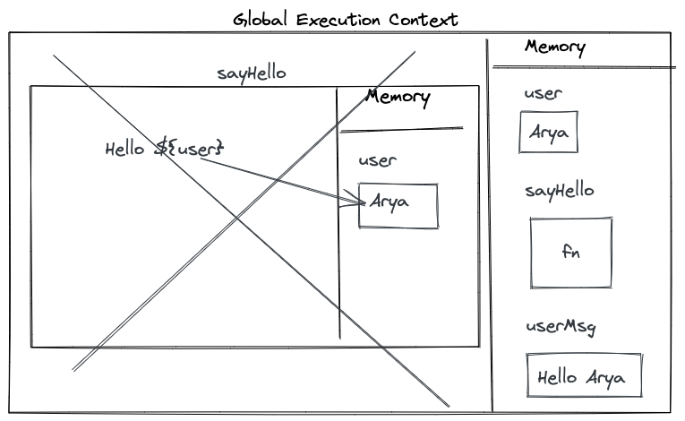

1. What does thread of execution means in JavaScript?  
   JavaScript engine take the code and execute it line by line which is know as thread of excecution and finally gives an output.

2. Where the JavaScript code gets executed?  
   JavaScript code get executed in JavaScript engine.

3. What does context means in Global Execution Context?
   any computation is happens in context part of global execution context.
4. When do you create a global execution context.  
   Global Execution Context created once for each javaScript program.
5. Execution context consists of what all things?  
   execution context consists of two things. first is memory which store all the data and second is where the code is executed.

6. What are the different types of execution context?  
   There are two types of execution context.

   1. Global execution Context
   2. Function execution Context

7. When global and function execution context gets created?
   when javaScript engine recieve script file it create a global execution context.
   inside script for each function execution, function execution context is created.

8. Function execution gets created during function execution or while declaring a function.
   when decalaring a function it got stored in memory part of exection context. function execution gets created during function execution.

9. Create a execution context diagram of the following code on your notebook. Take a screenshot/photo and store it in the folder named `img`. Use `` to display it here.

```js
var user = "Arya";

function sayHello() {
  return `Hello ${user}`;
}

var userMsg = sayHello(user);
```

<!-- Put your image here -->




```js
var marks = 400;
var total = 500;

function getPercentage(amount, totalAmount) {
  return (amount * 100) / totalAmount;
}

var percentageMarks = getPercentage(marks, total);
var percentageProfit = getPercentage(400, 200);
```

<!-- Put your image here -->


```js
var age = 21;

function customeMessage(userAge) {
  if (userAge > 18) {
    return `You are an adult`;
  } else {
    return `You are a kid`;
  }
}

var whoAmI = customeMessage(age);
var whoAmIAgain = customeMessage(12);
```

<!-- Put your image here -->


